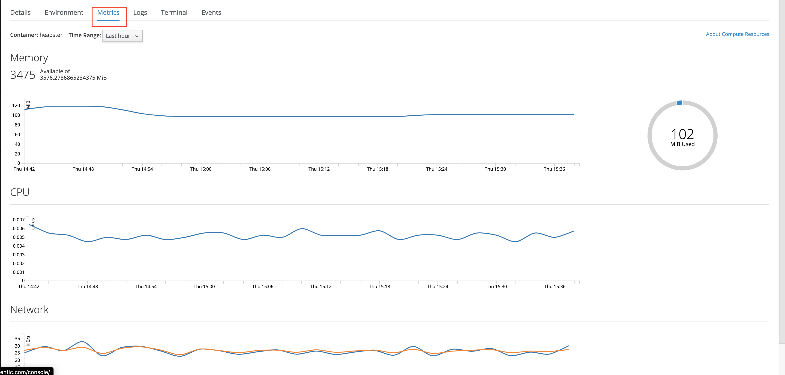
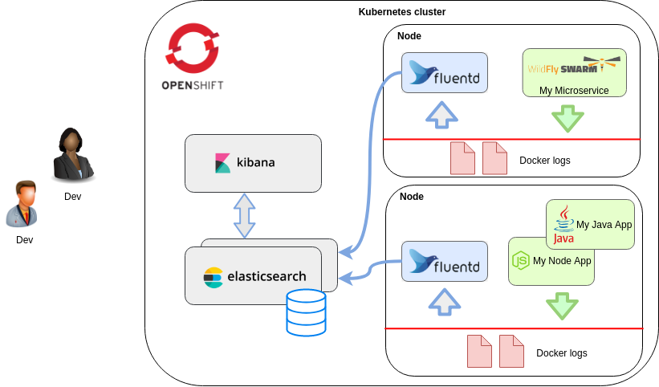
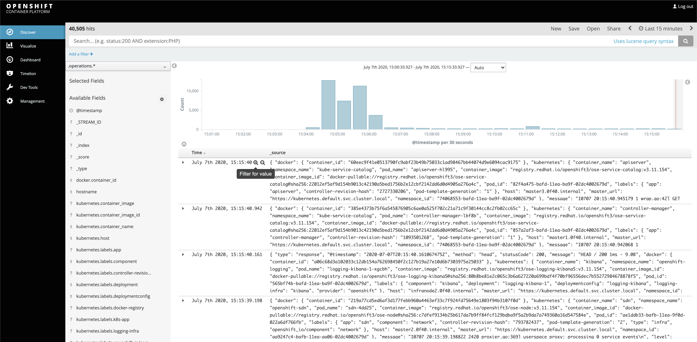
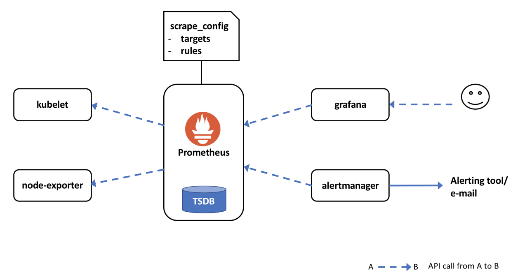
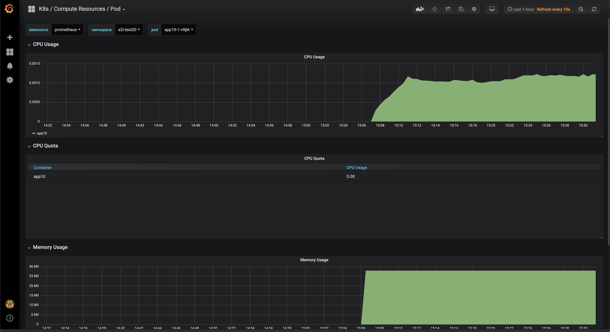
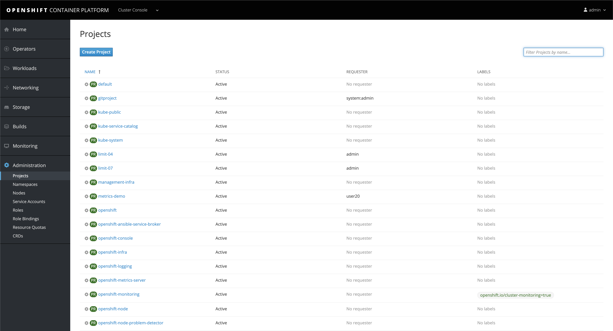

[Talleres de Despliegue](../despliegue.md)

OpenShift cuenta con la implementacion de multiples proyectos implementados dentro del mismo Cluster de OpenShift los cuales permiten realizar temas como Monitoreo y  auditoria de logs entre otros.

# Metricas del cluster 
El proyecto llamado `openshift-infra` el cual esta compuesto por 3 componentes:
* Heapster
* Hawkular
* Cassandra 


El agente kubelet expone métricas que Heapster puede recopilar y almacenar en back-end, Hawkular Metrics actua como un motor de métricas que almacena los datos de forma persistente en una base de datos Cassandra

Cuando se ingresa las primera veces a la interfase web de OpenShift se podra visualizar un mensaje como este: an error ocurred getting metrics


Esto se debe a que el componente Hawkular esta desplegado por HTTPS con un certificado autofirmado, para ello se debe aceptar el certificado digital en el navegador de la siguiente forma:


y una vez aceptado el certificado deberiamos visualizar el logo del proyecto Hawkular


De ser asi, se debe volver a la interfase web de OpenShift y recargar la interfase (F5) y ahora se deberia poder conocer la informacion de uso de los contenedores de una forma visual


Tambien se puede obtener informacion mas detallada ingresando directamente dentro del pod en la pestaña de metricas



> Nota
>
> Para mayor informacion: https://docs.openshift.com/container-platform/3.11/install_config/cluster_metrics.html

# Servicio de Logs del Cluster

El proyecto llamado `openshift-logging` es otra los proyectos desgledados sobre los nodos de infra, este proyecto tambien es conocido como EFK por sus multiples componentes (elasticsearch, fluentd y Kubana) los cuales se encargan de la recolexion de logs (fluentd) para ser enviados a un motor de búsqueda y análisis de para todo tipo de datos, en este caso logs (elasticsearch) y permitir visualizarlos a traves de un portal web (kibana)

Como administrador de clúster de OpenShift Container Platform, puede implementar el stack EFK para agregar registros para una gama de servicios de OpenShift Container Platform. 
Los desarrolladores de aplicaciones pueden ver los registros de los proyectos para los que tienen acceso de visualización. el stack EFK agrega registros de hosts y aplicaciones, ya sea que provengan de múltiples contenedores o incluso de pods eliminados. OpenShift cuenta con un stack de EFK lista para OpenShift y se compone de: 
Elasticsearch (ES): un almacén de objetos donde se almacenan todos los registros. 
Fluentd: Reúne registros de nodos y los alimenta a Elasticsearch. 
Kibana: una interfaz de usuario web para Elasticsearch.



```
https://kibana.apps.0f40.example.opentlc.com/
```




> Nota
>
> Para mayor informacion: https://docs.openshift.com/container-platform/3.11/install_config/aggregate_logging.html


https://loadbalancer.0f40.example.opentlc.com/


# Monitoreo del Cluster
El proyecto llamado `openshift-monitoring` OpenShift Container Platform tambien se entrega con un stack de monitoreo preconfigurada y de actualización automática que se basa en el proyecto de código abierto Prometheus y su ecosistema más amplio. Proporciona monitoreo de los componentes del clúster y se envía con un conjunto de alertas para notificar inmediatamente al administrador del clúster sobre cualquier problema que ocurra y un conjunto de paneles de Grafana.

En el corazón del stack de monitoreo se encuentra el Operador de Monitoreo del Clúster de OpenShift (CMO), que vigila los componentes y recursos de monitoreo desplegados, y asegura que estén siempre actualizados. El Operador Prometheus (PO) crea, configura y administra las instancias de Prometheus y Alertmanager. También genera automáticamente configuraciones de destino de monitoreo basadas en consultas familiares de etiquetas de Kubernetes. Además de Prometheus y Alertmanager, OpenShift Container Platform Monitoring también incluye nodo-exporter y kube-state-metrics. Node-exporter es un agente implementado en cada nodo para recopilar métricas al respecto. El agente exportador kube-state-metrics convierte los objetos de Kubernetes en métricas consumibles por Prometheus.



https://grafana-openshift-monitoring.apps.0f40.example.opentlc.com/



> Nota
>
> Para mayor informacion: https://docs.openshift.com/container-platform/3.11/install_config/prometheus_cluster_monitoring.html


# Administracion del Cluster
Por ultimo el proyecto `openshift-console` permite ingresar a la parte admistrativa del cluster, donde se podran visualizar datos relacionados directamente con el cluster, tales como consumo de los nodos, administracion de los volumenes persistente, manejo de operadores entre otros.




# Taller

1. Ingrese desde la interfase e intente visualizar las metricas de cada uno de los pods

2. Ingrese al url de kibana y valide los servicios de logs recolectados

3. Ingrese al url de Grafana y revise los dashboards por defecto

4. Ingrese al portal administrativo de cluster como usuario admin

