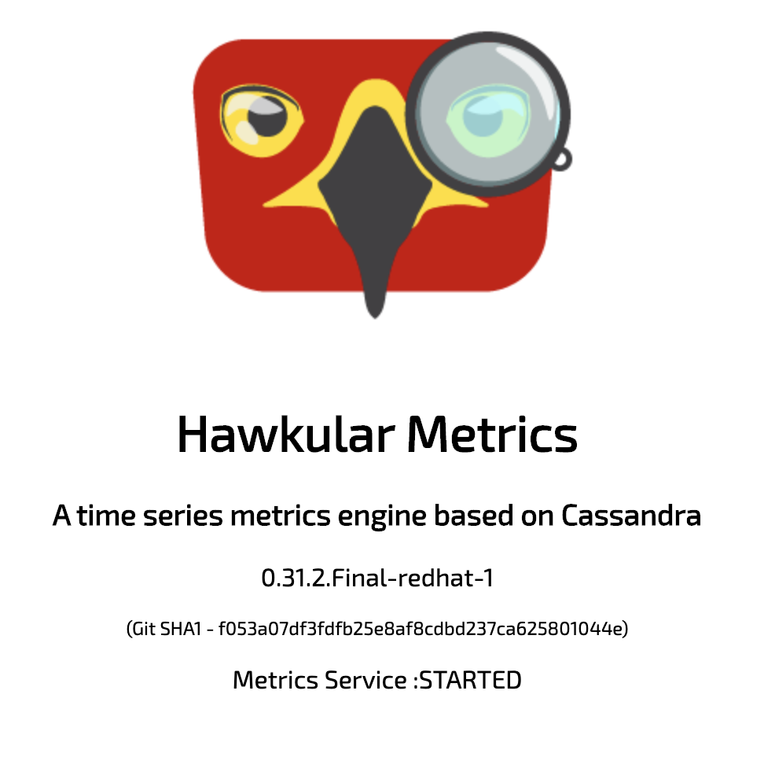

[Talleres de Despliegue](../despliegue.md)

OpenShift cuenta con la implementacion de multiples proyectos implementados dentro del mismo Cluster de OpenShift los cuales permiten realizar temas como Monitoreo y  auditoria de logs entre otros.

# Metricas del cluster 
El proyecto llamado `openshift-infra` el cual esta compuesto por 3 componentes:
* Heapster
* Hawkular
* Cassandra 

El agente kubelet expone métricas que Heapster puede recopilar y almacenar en back-end, Hawkular Metrics actua como un motor de métricas que almacena los datos de forma persistente en una base de datos Cassandra

Cuando se ingresa las primera veces a la interfase web de OpenShift se podra visualizar un mensaje como este: an error ocurred getting metrics

Esto se debe a que el componente Hawkular esta desplegado por HTTPS con un certificado autofirmado, para ello se debe aceptar el certificado digital en el navegador de la siguiente forma:

y una vez aceptado el certificado deberiamos visualizar el logo del proyecto Hawkular

De ser asi, se debe volver a la interfase web de OpenShift y recargar la interfase (F5) y ahora se deberia poder conocer la informacion de uso de los contenedores de una forma visual

Tambien se puede obtener informacion mas detallada ingresando directamente dentro del pod en la pestaña de metricas

> Nota
>
> Para mayor informacion: https://docs.openshift.com/container-platform/3.11/install_config/cluster_metrics.html

# Metricas del cluster 

# Taller

1. Ingrese desde la interfase e intente visualizar las metricas de cada uno de los pods

2. 
